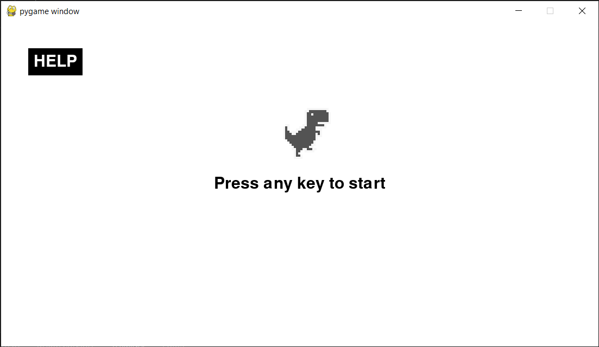
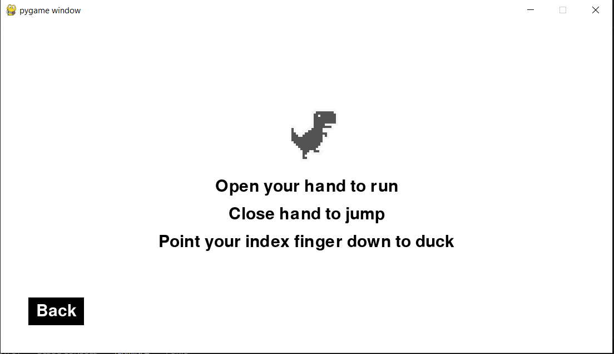
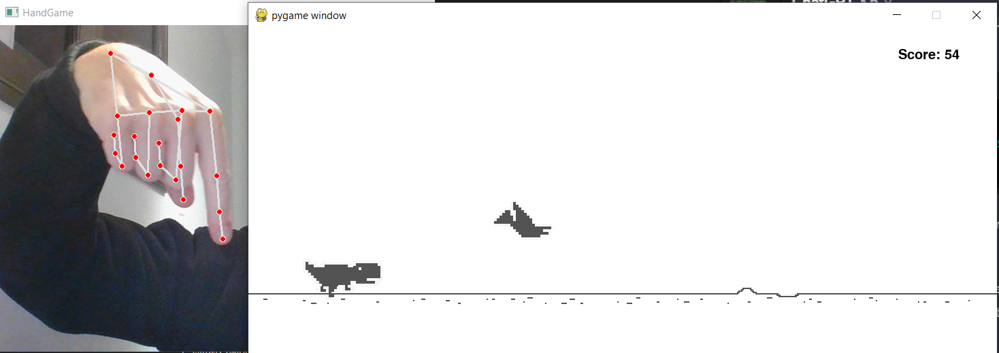
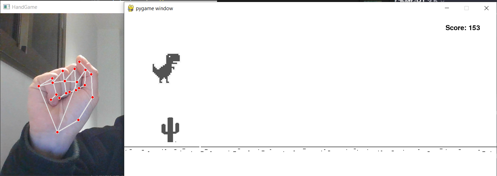
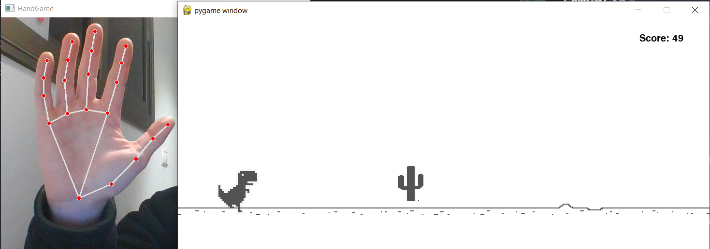

# Hand Controlled Dino Game

Hand Controlled Dino Game is a simple Python game where you control a dinosaur using hand gestures. The game utilizes the pygame library for graphics and interaction, as well as Mediapipe for hand gesture detection.

## Prerequisites

To run the game, you need to have the following installed:

- Python (version 3.11)
- Pygame library
- Mediapipe library

To play the game you will also need a computer camera or an external camera to be connected.

## How to Play

- Press any key to start the game.
- Control the dinosaur using hand gestures 
- Avoid obstacles to survive, Your score increases over time.

## Controls

- **Jumping**: Close your hand (make a fist).
- **Ducking**: Point your Index finger downwards.
- **Running**: Open your hand.

## Features

- Hand-controlled gameplay for an interactive experience.
  
- Dynamic obstacle generation to keep the game challenging.

- Scrolling background and clouds for a visually engaging environment.

- Score tracking to measure your progress.

## Screenshots

  
  
  
  
  

